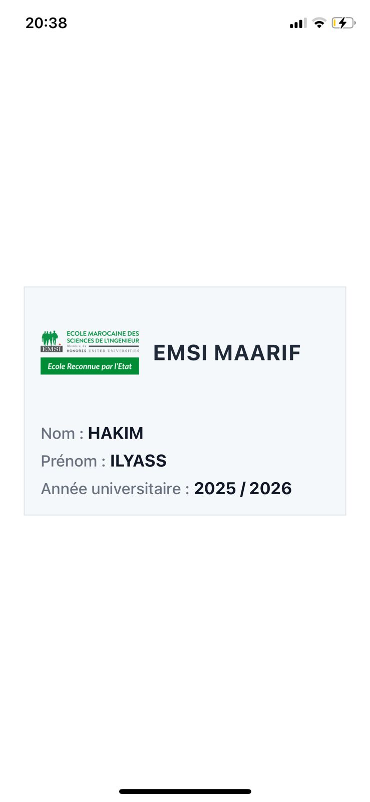

# Carte Étudiante EMSI — TP1 React Native

Une application simple réalisée dans le cadre du **TP1 en React Native**, affichant une carte étudiante avec le **logo de l’EMSI**, le **nom de l’école**, ainsi que les **informations de l’étudiant** (Nom, Prénom, Année universitaire).

  

